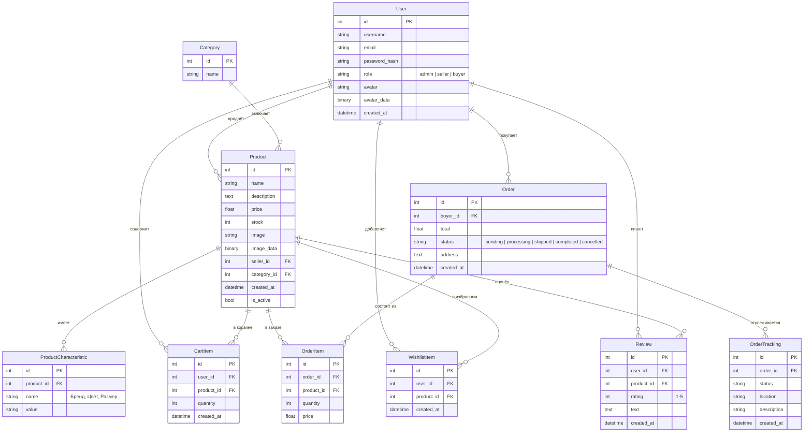

```mermaid
erDiagram
    User ||--o{ Product : "продаёт"
    User ||--o{ Order : "покупает"
    User ||--o{ WishlistItem : "добавляет"
    User ||--o{ Review : "пишет"
    User ||--o{ CartItem : "содержит"

    Category ||--o{ Product : "включает"

    Product ||--o{ ProductCharacteristic : "имеет"
    Product ||--o{ CartItem : "в корзине"
    Product ||--o{ OrderItem : "в заказе"
    Product ||--o{ WishlistItem : "в избранном"
    Product ||--o{ Review : "оценён"

    Order ||--o{ OrderItem : "состоит из"
    Order ||--o{ OrderTracking : "отслеживается"

    User {
        int id PK
        string username
        string email
        string password_hash
        string role "admin | seller | buyer"
        string avatar
        binary avatar_data
        datetime created_at
    }

    Category {
        int id PK
        string name
    }

    Product {
        int id PK
        string name
        text description
        float price
        int stock
        string image
        binary image_data
        int seller_id FK
        int category_id FK
        datetime created_at
        bool is_active
    }

    ProductCharacteristic {
        int id PK
        int product_id FK
        string name "Бренд, Цвет, Размер..."
        string value
    }

    CartItem {
        int id PK
        int user_id FK
        int product_id FK
        int quantity
        datetime created_at
    }

    Order {
        int id PK
        int buyer_id FK
        float total
        string status "pending | processing | shipped | completed | cancelled"
        text address
        datetime created_at
    }

    OrderItem {
        int id PK
        int order_id FK
        int product_id FK
        int quantity
        float price
    }

    OrderTracking {
        int id PK
        int order_id FK
        string status
        string location
        string description
        datetime created_at
    }

    WishlistItem {
        int id PK
        int user_id FK
        int product_id FK
        datetime created_at
    }

    Review {
        int id PK
        int user_id FK
        int product_id FK
        int rating "1-5"
        text text
        datetime created_at
    }
```
