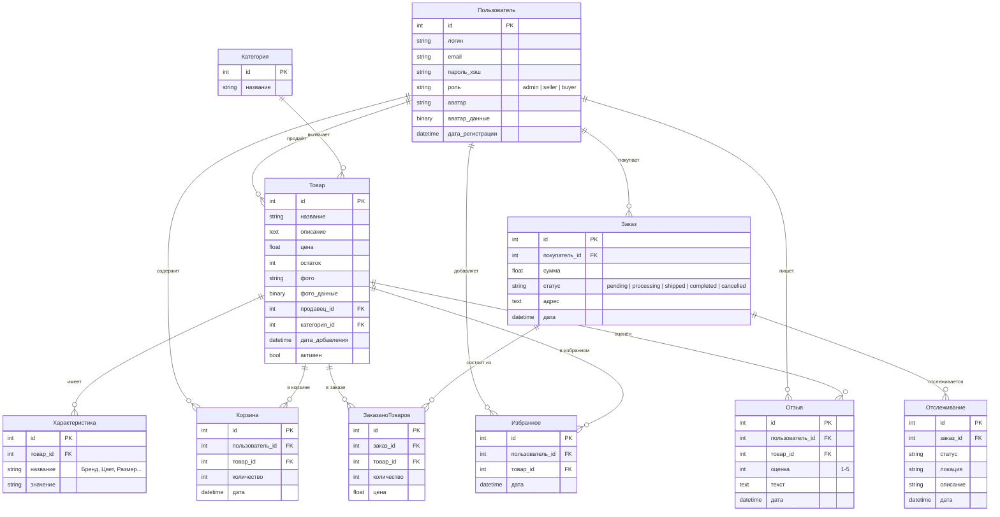

```mermaid
erDiagram
    Пользователь ||--o{ Товар : "продаёт"
    Пользователь ||--o{ Заказ : "покупает"
    Пользователь ||--o{ Избранное : "добавляет"
    Пользователь ||--o{ Отзыв : "пишет"
    Пользователь ||--o{ Корзина : "содержит"

    Категория ||--o{ Товар : "включает"

    Товар ||--o{ Характеристика : "имеет"
    Товар ||--o{ Корзина : "в корзине"
    Товар ||--o{ ЗаказаноТоваров : "в заказе"
    Товар ||--o{ Избранное : "в избранном"
    Товар ||--o{ Отзыв : "оценён"

    Заказ ||--o{ ЗаказаноТоваров : "состоит из"
    Заказ ||--o{ Отслеживание : "отслеживается"

    Пользователь {
        int id PK
        string логин
        string email
        string пароль_хэш
        string роль "admin | seller | buyer"
        string аватар
        binary аватар_данные
        datetime дата_регистрации
    }

    Категория {
        int id PK
        string название
    }

    Товар {
        int id PK
        string название
        text описание
        float цена
        int остаток
        string фото
        binary фото_данные
        int продавец_id FK
        int категория_id FK
        datetime дата_добавления
        bool активен
    }

    Характеристика {
        int id PK
        int товар_id FK
        string название "Бренд, Цвет, Размер..."
        string значение
    }

    Корзина {
        int id PK
        int пользователь_id FK
        int товар_id FK
        int количество
        datetime дата
    }

    Заказ {
        int id PK
        int покупатель_id FK
        float сумма
        string статус "pending | processing | shipped | completed | cancelled"
        text адрес
        datetime дата
    }

    ЗаказаноТоваров {
        int id PK
        int заказ_id FK
        int товар_id FK
        int количество
        float цена
    }

    Отслеживание {
        int id PK
        int заказ_id FK
        string статус
        string локация
        string описание
        datetime дата
    }

    Избранное {
        int id PK
        int пользователь_id FK
        int товар_id FK
        datetime дата
    }

    Отзыв {
        int id PK
        int пользователь_id FK
        int товар_id FK
        int оценка "1-5"
        text текст
        datetime дата
    }
```
